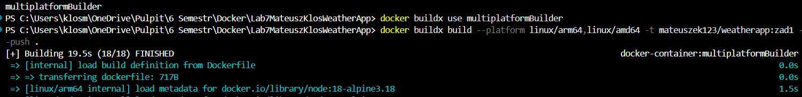
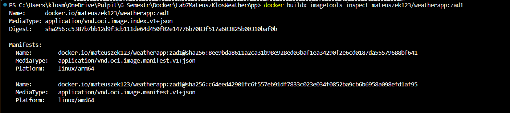
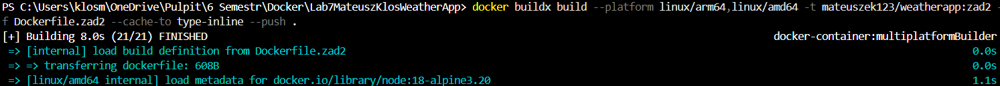
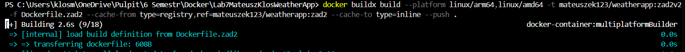

# WeatherApp – Docker Lab

## Użyte Polecenia

### ✅ Zad1

# utworzenie Buildera
docker buildx create --name multiplatformBuilder --driver docker-container --bootstrap
# Domyslny 
docker buildx use multiplatformBuilder
# Budowanie i push
docker buildx build --platform linux/arm64,linux/amd64 \
  -t mateuszek123/weatherapp:zad1 \
  -f Dockerfile.zad1 \
  --push .
  
# sprawdzenie 
docker buildx imagetools inspect mateuszek123/weatherapp:zad1

### ✅ Zad2 - dodatkowo cache (eksporter registry oraz backend inline)

# budowanie z eksporterem cache
docker buildx build --platform linux/arm64,linux/amd64 \
  -t mateuszek123/weatherapp:zad2 \
  -f Dockerfile.zad2 \
  --cache-to type=inline \
  --push .
  
# budowanie z wykorzystaniem cache 
docker buildx build --platform linux/arm64,linux/amd64 \
  -t mateuszek123/weatherapp:zad2v2 \
  -f Dockerfile.zad2 \
  --cache-from type=registry,ref=mateuszek123/weatherapp:zad2 \
  --cache-to type=inline \
  --push .
  
# sprawdzenie 
docker buildx imagetools inspect mateuszek123/weatherapp:zad2v2

### ✅ Zad3 - dodatkowo cache, rozszerzony frontend bulidkit, mount ssh, 
Aby uruchomić budowanie w podpunkcie 3 (wykorzystując ssh) przechodzę (windows) do Git Bash.
Uruchamiam ssh-agent ( eval $(ssh-agent -s) )
A nastęnie dodaję klucz ( ssh-add ~/.ssh/id_rsa)
*Edit
Git bash również nie łączy na windows 
3 próba na WSL 
*wsl również nie widzi repozytorium 
# budowanie z cache registry mode=max
docker buildx build --platform linux/arm64,linux/amd64 \
  -t mateuszek123/weatherapp:zad3 \
  -f Dockerfile.zad3 \
  --secret id=sshkey,src="$HOME/.ssh/id_rsa" \
  --cache-to type=registry,ref=mateuszek123/weatherapp-cache:latest,mode=max \
  --push .